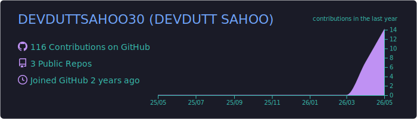
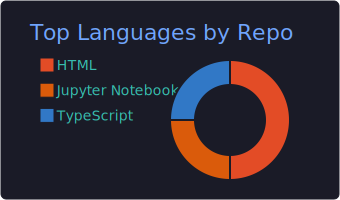
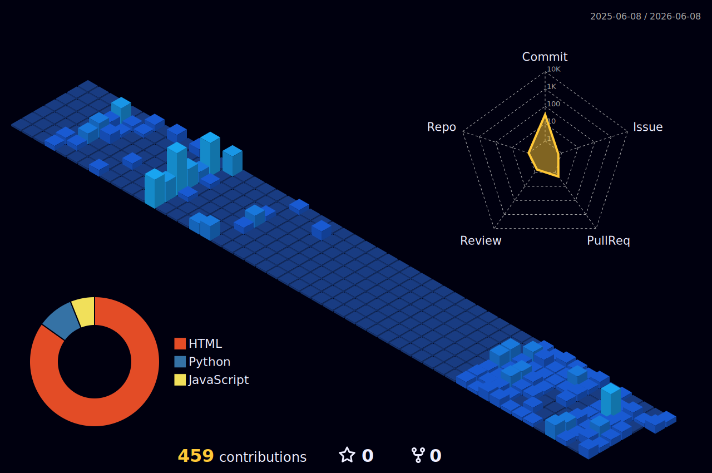

  
  
    

  

  

    <b>CS Undergrad | Full-Stack Developer | ML Enthusiast</b>
  

  

    
  

## 🕷️ Technologies I've Worked With

  <h4>💻 Languages</h4>
  

   

  <h4>🧱 Libraries & Frameworks</h4>
  

   

  <h4>🗄️ Databases & ORMs</h4>
  

   

  <h4>☁️ Cloud & DevOps</h4>
  

   

  <h4>🧰 Tools & IDEs</h4>
  

   

  <h4>🌐 Markup & Core Stack</h4>
  

   

  <h4>🖥️ OS & Shell</h4>
  

 

  

 

## ⚡ Multiverse Analytics

  
  

 

## 🏙️ Multiverse Contribution Cityscape

  

    <i>A 3D representation of my open-source momentum and coding activity.</i>
  

  

 

  

 

## 📬 Contact Me

  
  
  

